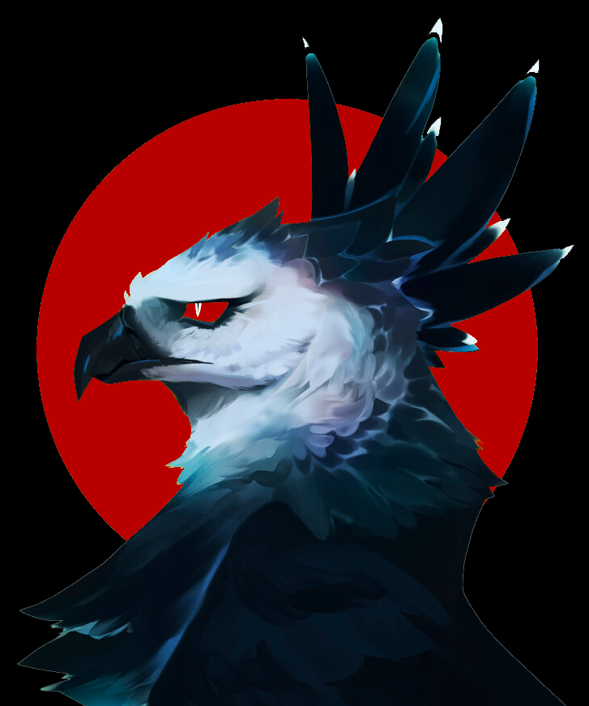

## Hi, I'm Fernando Belotto!

- 👨‍💻 I'm an **software engineer**
- 🚀 Who is currently working at _dLocal_
- 📫 So lets talk about technology! you can reach me by email or any of my social profiles.
- 👨‍🔬 Fun fact: I got an chemistry background

#### Find me on:

#### Check some of my translations here 👇

[React-Redux](https://fernandobelotto.github.io/react-redux)  
[Creat-React-App](https://fernandobelotto.github.io/create-react-app)  
[Redux-Toolkit](https://fernandobelotto.github.io/redux-toolkit) [in progress]  

Illustration by <a href="https://dribbble.com/thierryfousse">Thierry Fousse</a>

 

